## Introduction

JSpice is a SPICE-inspired analog circuit simulator made in Java with an emphasis on simulating memristors and analog circuits containing memristors. 

In a nutshell, JSpice is very limited compared to mainstream SPICE versions and only can do the following:

1. DC Operating Point Analysis
2. DC Sweep Analysis
3. Transient Analysis (Time response to arbitrary input waveform)

JSpice was originally written at a time before any mainstream SPICE applications supported simulation of memristors, and at that point we felt it would be easier to write a custom version of SPICE in Java rather than to try to figure out how to natively integrate memristor devices into existing SPICE versions. More recently, other, more capable simulators such as Xyce, have appeared with [native support for memristors](http://knowm.org/native-memristor-device-development-in-xyce/), and we are now leveraging those tools for CMOS + memristor circuit simulations.

JSpice is however still useful for rapid prototyping and serves as the simulation engine for [mem-sim](https://github.com/knowm/mem-sim). JSpice may interest you if you are interested in learning the mechanics of modified nodal analysis and your favorite programming langauge is Java. 

## Flow Chart of JSpice

Following is a simplified block diagram of the main JSpice program flow. 

)](documentation/SPICE_flow_chart.png)  

### In Words

- while the simulation is not over  
    * Formulate companion models for energy storage components, using current operating point  
    * Newton loop :  
        * while the convergence is not achieved  
            - Formulate companion models for non−linear components, using current operating point  
            - Solve for new operating point  
        * end while   
- end while  

([source](http://dev.hypertriton.com/edacious/trunk/doc/lec.pdf))

The heart of JSpice is matrix multiplication to solve the node values.

## Linear DC Operating Point Analysis

The core of any circuit simulation software is DC Operating Point Analysis. It's required for an initial solution to a Transient Analysis and also at each time step of a DC Sweep Analysis. All energy-storage components like capacitors, inductors and semiconductor charge mechanisms are ignored for this analysis. To perform a very basic DC Operating Point Analysis, the circuit Netlist needs to be loaded and parsed followed by solving linear nodal equations for voltage at each node:

1. Import Netlist
1. AC sources are zeroed out, capacitors are opened, and inductors are shorted
1. Use Kirchhoff's current law (KCL) to determine the algebraic sum of currents at each node
1. Using Linear Algebra, solve for the voltages at each node: G • v = i, where G is the conductance coefficients, v and i is the voltage and current at each node respectively.

A computerized circuit solver like SPICE doesn't start by writing nodal equations and converting them into a matrix. An advanced technique called Modified Nodal Analysis (MNA) is used. Each device has an MNA Stamp which is directly inserted into the impedance matrix (G) and the fixed source matrix (also called the right-hand-side matrix, RHS). Each voltage node and voltage source has a row/column pair and a slot in the RHS matrix. Each device is provided with pointers to locations in the matrix that it effects. That way a device doesn't have to have knowledge of the entire circuit, just the nodes it effects.

Like SPICE since version 3f5, JSpice uses MNA for Nodal Analysis, and it uses LUDecomposition to solve the systems of linear equations to determine the nodal values. For more information about MNA and MNA Stamps see the following links:

1. <http://users.ecs.soton.ac.uk/mz/CctSim/contents.htm>
1. <http://www.ece.iisc.ernet.in/~dipanjan/E8_262/E8262-CAD_4+5.pdf>
1. <http://qucs.sourceforge.net/tech/technical.html>
1. <http://dev.hypertriton.com/edacious/trunk/doc/lec.pdf>
1. <http://qucs.sourceforge.net/tech/node14.html>
1. <http://users.ecs.soton.ac.uk/mz/CctSim/chap1_3.htm>
1. <http://users.ecs.soton.ac.uk/mz/CctSim/chap1_4.htm>
1. <https://www.scribd.com/document/277142543/MNA-Stamp>


The above formulation of MNA can be applied to linear circuits only, but can extend to nonlinear. A linear circuit is an electronic circuit in which, for a sinusoidal input voltage of frequency f, any steady-state output of the circuit (the current through any component, or the voltage between any two points) is also sinusoidal with frequency f. Note that the output need not be in phase with the input.

The costs of the automatic circuit equation formulation:

1. To parse the Netlist : It consists in reading and storing the Netlist. O(N).
1. A topological analysis to build the unknowns vector: The Minimum Spanning Tree algorithm complexity is O(Nlog(N))
1. Stamping method: Each component writes its contribution in the table equation. O(N).
1. Matrix product: Multiplied two dense matrices costs O(N^3).

### Linear DC Operating Point Analysis Examples

#### I1R3 - One Current Source and Three Resistors

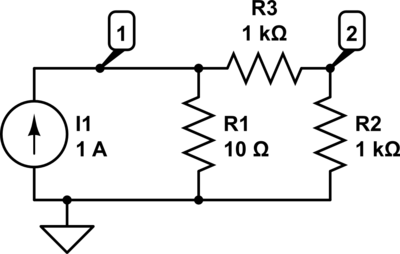  

##### Code

Here, the `NetlistBuilder` pattern is demonstrated.

```java
public class DCOPI1R3 {

  public static void main(String[] args) {

    // run via NetlistBuilder
    NetlistBuilder builder = new NetlistBuilder().addNetlistDCCurrent("a", 1.0, "0", "1").addNetlistResistor("R1", 10, "1", "0")
        .addNetlistResistor("R2", 1000, "1", "2").addNetlistResistor("R3", 1000, "2", "0");
    Netlist netlist = builder.build();
    JSpice.simulate(netlist);
  }
}
```


##### Result

```
----nodes----
V(1) = 9.950248756218906
V(2) = 4.975124378109452
----components----
I(R1) = 0.9950248756218907
I(R2) = 0.004975124378109454
I(R3) = 0.004975124378109453
I(a) = 1.0
-------------
```


#### I1V1R6 -  One Current Source, One Voltage Source and Six Resistors

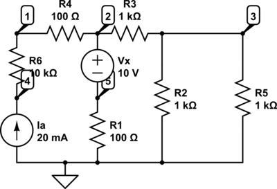  

##### Code

Here, the `Netlist` is created as a stand-alone class, ideal for circuit reuse.

```java
public class DCOPI1V1R6 {

  public static void main(String[] args) {

    Netlist netlist = new I1V1R6();
    JSpice.simulate(netlist);
  }
}
```

```java
public class I1V1R6 extends Netlist {

  public I1V1R6() {

    // build netlist, the nodes can be named anything except for ground whose node is always labeled "0"
    addNetListComponent(new NetlistDCCurrent("a", 0.02, "0", "4"));
    addNetListComponent(new NetlistDCVoltage("x", 10.0, "2", "5"));
    addNetListComponent(new NetlistResistor("R1", 100, "5", "0"));
    addNetListComponent(new NetlistResistor("R2", 1000, "0", "3"));
    addNetListComponent(new NetlistResistor("R3", 1000, "2", "3"));
    addNetListComponent(new NetlistResistor("R4", 100, "1", "2"));
    addNetListComponent(new NetlistResistor("R5", 1000, "3", "0"));
    addNetListComponent(new NetlistResistor("R6", 10000, "1", "4"));
  }
}
```

##### Result

```
----nodes----
I(x) = 0.01250000000000003
V(1) = 13.250000000000005
V(2) = 11.250000000000004
V(3) = 3.750000000000001
V(4) = 213.25
V(5) = 1.2500000000000029
----components----
I(R1) = 0.012500000000000028
I(R2) = -0.0037500000000000007
I(R3) = 0.007500000000000002
I(R4) = 0.020000000000000018
I(R5) = 0.0037500000000000007
I(R6) = -0.02
I(a) = 0.02
-------------
```

## DC Sweep Analysis

DC Sweep Analysis is used to calculate a circuit’s bias point over a range of values. This procedure allows you to simulate a circuit many times, sweeping the DC values within a predetermined range. You can control the source values by choosing the start and stop values and the increment for the DC range. The bias point of the circuit is calculated for each value of the sweep.   

JSpice performs DC Sweep Analysis using the following process:

1. The DC Operating Point is calculated using a specified start value.
1. The value from the source is incremented and another DC Operating Point is calculated.
1. The increment value is added again and the process continues until the stop value is reached.
1. The result is displayed in a chart.

Assumptions: Capacitors are treated as open circuits, inductors as shorts. Only DC values for voltage and current sources are used.

All energy-storage components like capacitors, inductors and semiconductor charge mechanisms are ignored for this analysis. When time-varying components are present, their long-term behavior is approximated for example, capacitors become open circuits, and inductors become short circuits.

#### DC Sweep V1R4 - One Voltage Source and Four Resistors

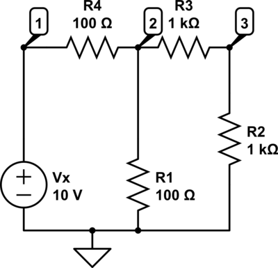  

##### Code

```java
public class DCSweepV1R4 {

  public static void main(String[] args) {

    Netlist netlist = new V1R4();
    netlist.setSimulationConfig(new DCSweepConfig("R1", "I(3)", 100.0, 10000, 100));
    JSpice.simulate(netlist);
  }
}
```

##### Result

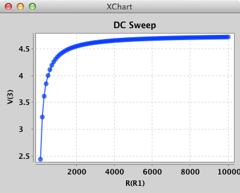  

## Non-Linear DC Operating Point Analysis

To simulate real circuits containing transistors and diodes, we are interested in simulating components having arbitrary i-v relations. We use the standard Newton method, described in any numerical analysis textbook. The derivation of how the multidimensional Newton method leads to our algorithm is a bit tedious, but here is an intuitive explanation : the Newton method works by linearizing the equation around the operating point Xn, solving the linearized equation to obtain Xn+1, and iterating until convergence (being when Xn is near Xn+1; the precise definition of near involving a compromise between speed and accuracy). In circuits, we linearize the i-v characteristic around point vn : i = i(vn)+(dv/di)(v−vn). That allows us to form companion models describing the linearized component, which we can stamp. The equation is then solved for another operating point, and the cycle continues until a stable answer is found.

### PN Diode Companion Model

)](documentation/PN_Diode_Model.png)  

#### DCSweepV1D1 - One Voltage Source and One Diode

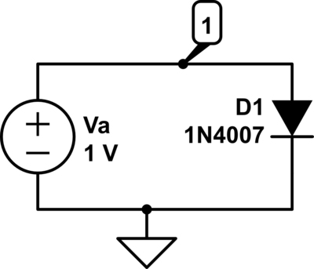  

##### Code

```java
public class DCSweepV1D1 {

  public static void main(String[] args) {

    Netlist netlist = new V1D1();
    netlist.setSimulationConfig(new DCSweepConfig("Va", "I(D1)", 0.5, .95, .005));
    JSpice.simulate(netlist);
  }
}
```

##### Result

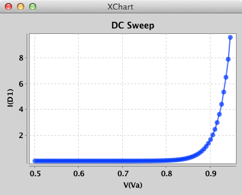  

### MOSFET NMOS Companion Model

)](documentation/NMOS_Model.png)  

#### DCSweepV2NMOS1 - Two Voltage Sources and One NMOS

  

##### Code

```java
public class DCSweepV2NMOS1 {

  public static void main(String[] args) {

    // Circuit
    Netlist netlist = new V2NMOS1();

    // SweepDef
    DCSweepConfig sweepDef1 = new DCSweepConfig("Vdd", "I(NMOS1)", 0.0, 10.0, 0.1);
    DCSweepConfig sweepDef2 = new DCSweepConfig("Vg", "I(NMOS1)", 0.0, 5.0, 1.0);

    // run DC sweep
    DCSweep dcSweep = new DCSweep(netlist);
    dcSweep.addSweepConfig(sweepDef1);
    dcSweep.addSweepConfig(sweepDef2);
    SimulationResult dcSweepResult = dcSweep.run("I(NMOS1)");

    // plot
    SimulationPlotter.plotAll(dcSweepResult);

  }
}
```

##### Result

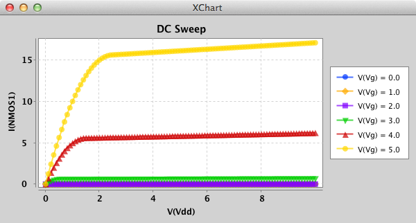  

### MOSFET PMOS Companion Model

)](documentation/PMOS_Model.png)  

#### DCSweepV2PMOS1 - Two Voltage Sources and One PMOS

##### Code

```java
public class DCSweepV2PMOS1 {

  public static void main(String[] args) {

    // Circuit
    Netlist netlist = new V2PMOS1();

    // SweepDef
    DCSweepConfig sweepDef1 = new DCSweepConfig("Vg", "I(PMOS1)", -5.0, 0.0, 1.0);
    DCSweepConfig sweepDef2 = new DCSweepConfig("Vdd", "I(PMOS1)", -10.0, 0.0, 0.1);

    // run DC sweep
    DCSweep dcSweep = new DCSweep(netlist);
    dcSweep.addSweepConfig(sweepDef2);
    dcSweep.addSweepConfig(sweepDef1);
    SimulationResult dcSweepResult = dcSweep.run("I(PMOS1)");
    System.out.println(dcSweepResult.toString());

    // plot
    SimulationPlotter.plotAll(dcSweepResult);
  }
}
```

##### Result

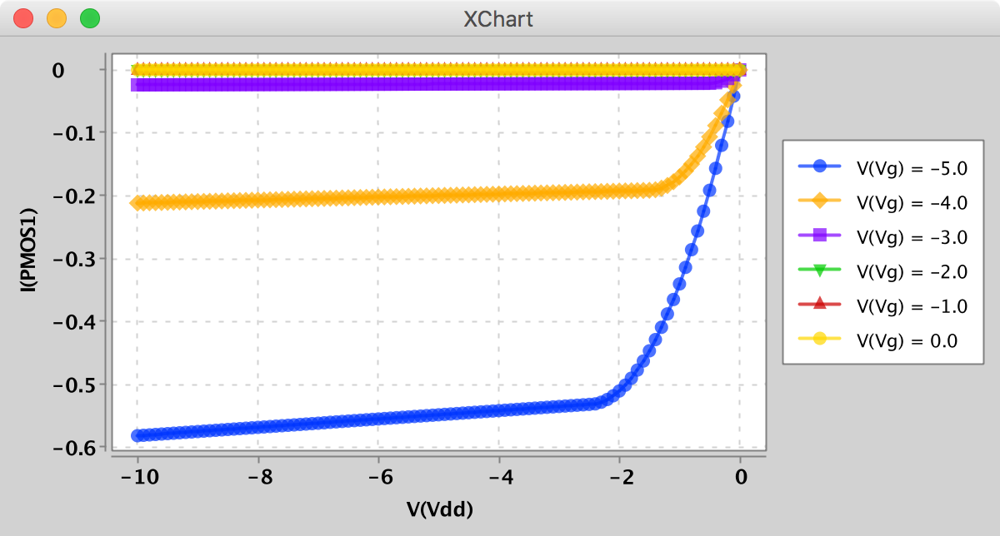  


#### CMOSInverter

##### Code

```java
public class DCSweepCMOSInverter {

  public static void main(String[] args) {

    Netlist netlist = new CMOSInverterCircuit();
    netlist.setSimulationConfig(new DCSweepConfig("Vin", "V(out)", 0, 5, .10));
    JSpice.simulate(netlist);
  }
}
```

##### Result

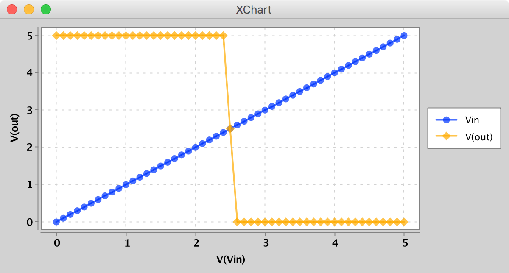  

 

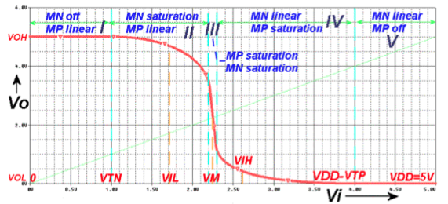 
 

## Transient Analysis

In Transient Analysis, also called time-domain transient analysis, JSpice computes the circuit’s response as a function of time. This analysis divides the time into segments and calculates the voltage and current levels for each given interval. Finally, the results, voltage versus time, are plotted.

JSpice performs Transient Analysis using the following process:

Each input cycle is divided into intervals.
A DC Operating Point Analysis is performed for each time point in the cycle.
The solution for the voltage waveform at a node is determined by the value of that voltage at each time point over one complete cycle.

Assumptions: DC sources have constant values; AC sources have time-dependent values. Capacitors and inductors are represented by energy storage models. Numerical integration is used to calculate the quantity of energy transfer over an interval of time.

Let's see how numeric integration for a capacitor works. Knowing a function at some point in time `tn`, how could you approximate the function at a future time point `tn+1`? Here's one approach. What if you looked to the slope of the curve to tell you, at least locally, where the voltage is going? Then, simply multiply the slope by the time step `h = Δt = tn+1 - tn` and add it to the present voltage - that should get you in the neighborhood at least.

The FE formula is so intuitive, but its not the best method. Another method, the backward- Euler (BE), uses the slope at `xn+1`, rather than the one at `xn`, to predict the next voltage.

Okay, we're approaching our overall goal of transforming an energy-storage component into its equivalent linear components. For example, a capacitor is transformed using a two step process:

Step 1. Apply numeric integration to the current-versus-voltage relationship of a capacitor.
Step 2. Use the result to develop a linear companion memristor well-suited for Nodal Analysis to calculate the circuit's output waveform.

Long story short, given the time step size (`h`) and the voltage across the capacitor at a certain time point, the capacitor is replaced in the circuit with the following linear companion memristor consisting of a Resistor and a current source. JSpice then carries out it's nodal analysis as before.

)](documentation/Capacitor_Model.png)  

### Drivers

The following time-based drivers are available: DC, Sine, Triangle, Sawtooth, Square, Pulse, Arbitrary, and Streaming Arbitrary. Most Drivers take the following arguments during creation:

* Name
* DC Offset
* Phase
* Amplitude
* Frequency

#### DC
    Driver driver = new DC("Vdc", 2.5);
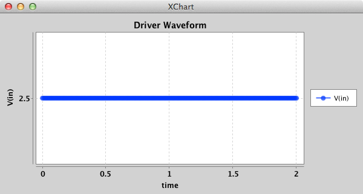  

#### Sine
    Driver sine = new Sine("Sine", 5, Math.PI / 4, 10, 2);
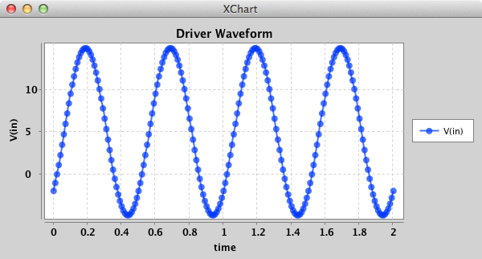  

#### Triangle
    Driver driver = new Triangle("Triangle", 5, 0.25, 10, 2);
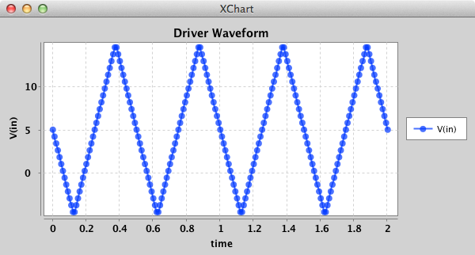  

#### Sawtooth
    Driver driver = new Sawtooth("Sawtooth", 5, .25, 10, 2);
  

#### Square
    Driver driver = new Square("Square", 5, .2, 10, .5); // unit test case
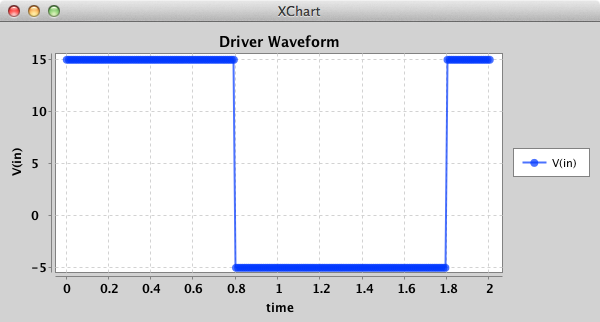  

#### Pulse
    Driver driver = new Pulse("Pulse", 5, .2, 10, .5, .10); // unit test case
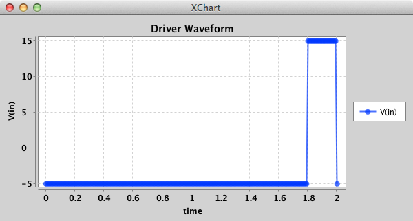  

#### Arbitrary
    Driver driver = new Arbitrary("Arbitrary", 0, 0, 1, 1.0, new double[] { .1, .2, .5, .6 });
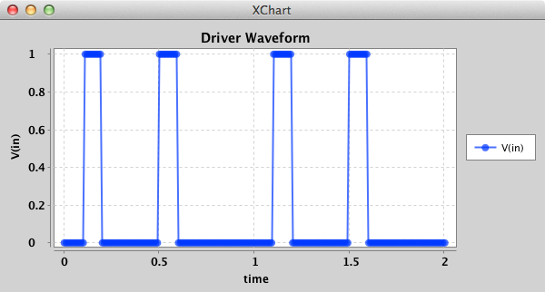  

#### Arbitrary Streaming
    Driver driver = new StreamingArbitrary("Arbitrary Streaming", 0, 0, 1, 1.0, new double[] { .1, .2, .5, .6 }, new String[] { "1", "0", "1" });
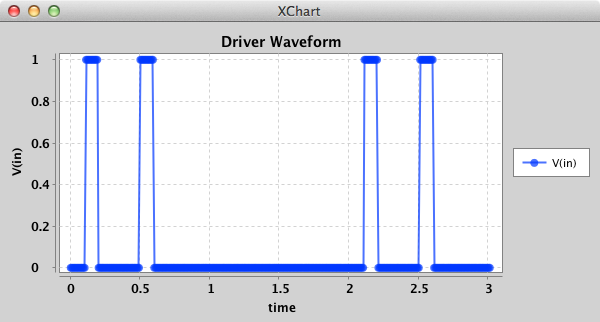  


#### CMOS Inverter with Triangle Driver

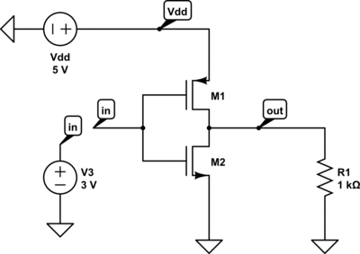  

##### Code

```java
public class TransientAnalysisCMOSInverter {

  public static void main(String[] args) {

    Netlist netlist = new CMOSInverterCircuit();
    TransientConfig transientConfig = new TransientConfig(2, .05, new Triangle("Vin", 2.5, 0, 2.5, 1.0));
    netlist.setSimulationConfig(transientConfig);
    SimulationResult simulationResult = JSpice.simulate(netlist);
    SimulationPlotter.plot(simulationResult, "V(in)", "V(out)");
  }
}
```

##### Result

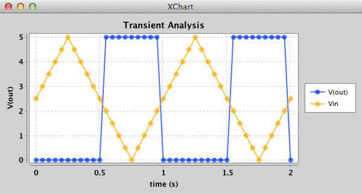  


#### RC Circuit with Square Driver

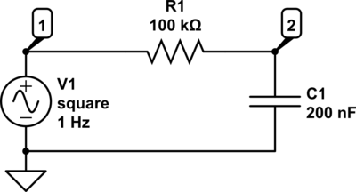  

##### Code

```java
public class TransientAnalysisV1R1C1 {

  public static void main(String[] args) {

    Netlist netlist = new V1R1C1();
    TransientConfig transientConfig = new TransientConfig(2, .01, new Square("V1", 2.5, 0, 2.5, 1.0));
    netlist.setSimulationConfig(transientConfig);
    SimulationResult simulationResult = JSpice.simulate(netlist);
    SimulationPlotter.plot(simulationResult, new String[]{"V(1)", "V(2)"});
  }
}
```

##### Result

  

#### Half-Wave Rectifier with Sine Driver

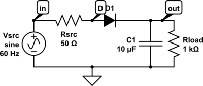  

##### Code

```java
public class TransientAnalysisHalfWaveRectifier {

  public static void main(String[] args) {

    Netlist netlist = new HalfWaveRectifier();
    TransientConfig transientConfig = new TransientConfig(.0833333333, .0002, new Sine("Vsrc", 0, 0, 12, 60.0));
    netlist.setSimulationConfig(transientConfig);
    SimulationResult simulationResult = JSpice.simulate(netlist);
    SimulationPlotter.plot(simulationResult, "V(in)", "V(out)");
  }
}
```

##### Result

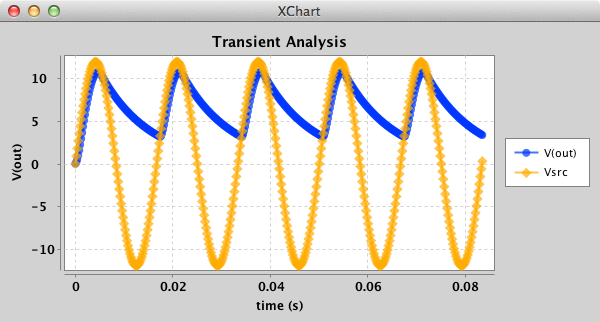  

#### Pass Gate (Transmission Gate)

  

##### Code

```java
public class TransientAnalysisTransmissionGate {

  public static void main(String[] args) {

    Netlist netlist = new TransmissionGateCircuit();

    Driver in = new Sine("Vin", 0, 0, 1.0, 10.0);
    Driver clk = new Square("Vclk", 2.5, 0, 2.5, 1.0);
    Driver clkBar = new Square("VclkBar", 2.5, 0.5, 2.5, 1.0);

    TransientConfig transientConfig = new TransientConfig(2, .005, in, clk, clkBar);
    netlist.setSimulationConfig(transientConfig);
    SimulationResult simulationResult = JSpice.simulate(netlist);
    SimulationPlotter.plotSeparate(simulationResult, "V(out)", "V(in)", "V(CLK)", "V(CLKBAR)");
  }
}
```

##### Result

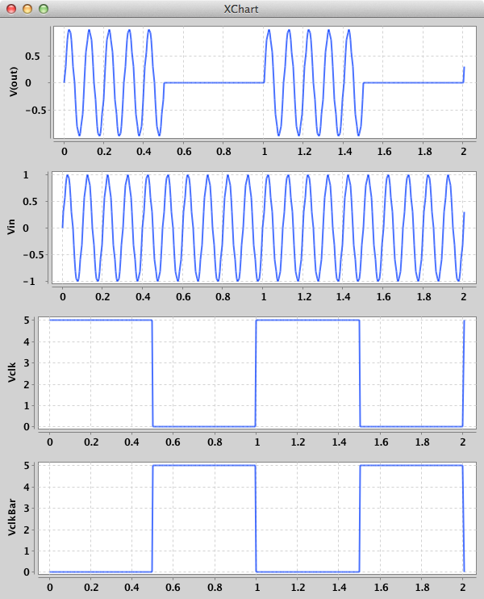  

## M-MSS Memristor Simulation

### Simple Hysteresis Curves

#### M-MSS Memristor Model Driven by Square Wave

##### Code

```java
public class TransientAnalysisV1MMSSMem {

  public static void main(String[] args) {

    Netlist netlist = new V1MMSSMem();
    TransientConfig transientConfig = new TransientConfig(.04, .0001, new Sine("Vdd", 0.0, 0, 0.5, 100.0));
    netlist.setSimulationConfig(transientConfig);
    SimulationResult simulationResult = JSpice.simulate(netlist);
    SimulationPlotter.plotSeparate(simulationResult, new String[]{"V(VDD)", "I(M1)"});
    SimulationPlotter.plotTransientInOutCurve("I/V Curve", simulationResult, new String[]{"V(VDD)", "I(M1)"});

  }
}
```

##### Result

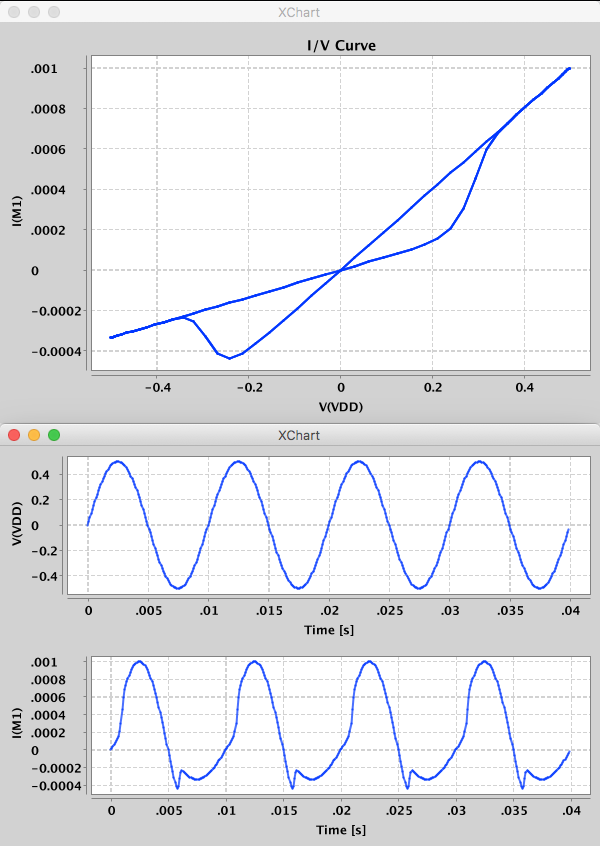  


## RS(Really Simple) Memristor Simulation

### Current vs. Time

#### RS Memristor Model Driven by Square Wave

##### Code

Option #1: `NetlistBuilder`

```java
public class TransientAnalysisRSMem {

  private final static double schottkeyAlpha = 0; // N/A
  private final static double schottkeyBeta = 0; // N/A
  private final static double phi = 1;

  public static void main(String[] args) throws IOException, ConfigurationException {

    // run via NetlistBuilder
    NetlistBuilder builder = new NetlistBuilder().addNetlistDCVoltage("Vdd", 1.0, "VDD", "0")
        .addNetlistRSMemristor("M1", schottkeyAlpha, schottkeyBeta, schottkeyAlpha, schottkeyBeta, phi, "VDD", "0")
        .addTransientSimulationConfig(1.0E-3, 1E-5, new Sine("Vdd", 0.0, 0, 1.2, 2000.0));
    Netlist netlist = builder.build();
    System.out.println("builder.getYAML() " + builder.getYAML());
    SimulationResult simulationResult = JSpice.simulate(netlist);
    SimulationPlotter.plot(simulationResult, "I(M1)");
  }
}
```

##### Result

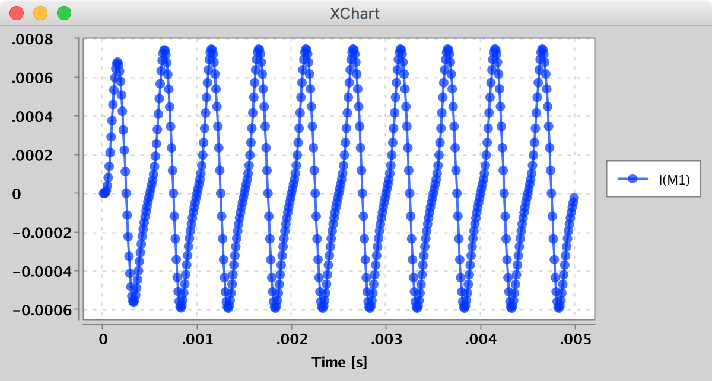

Before the simulation, a JSpice netlist, in YAML format, is printed out with `System.out.println("builder.getYAML() " + builder.getYAML());`:

```yaml
components:
- type: dc_voltage
  nodes: VDD,0
  id: Vdd
  voltage: 1.0
- type: rs_mem
  nodes: VDD,0
  id: M1
  schottky_forward_alpha: 0.0
  schottky_forward_beta: 0.0
  schottky_reverse_alpha: 0.0
  schottky_reverse_beta: 0.0
  phi: 1.0
sim:
  type: trans
  stop_time: 0.001
  time_step: 1.0E-5
  drivers:
  - type: sine
    id: Vdd
    dc_offset: 0.0
    phase: 0.0
    amplitude: 1.2
    frequency: 2000.0
```

Option #2: run via Yml file

```java
public class TransientAnalysisRSMem {

  public static void main(String[] args) throws IOException, ConfigurationException {

    SimulationResult simulationResult = JSpice.simulate("RSMem.yml");
    SimulationPlotter.plot(simulationResult, "I(M1)");
  }
}
```

Option #2: run via jar

```
java -jar jspice.jar RSMem.yml
```

If run via the command line like this the output will be a file in the same folder as the netlist file. For this example `RSMem.yml.out`:

```
Index   Time        I(Vdd)      V(VDD)      I(M1)       
0   0.000010        -1.5039988203475277E-8  0.1503998802771651  1.5039988203475277E-8   
1   0.000020        -2.984278680852828E-8   0.2984278645978257  2.984278680852828E-8    
2   0.000030        -2.1832594377210504E-6  0.4417494632216135  2.1832594377210504E-6   
3   0.000040        -1.3887502330681323E-5  0.5781044089220584  1.3887502330681323E-5   
4   0.000050        -3.953072280230764E-5   0.7053423027509678  3.953072280230764E-5    
5   0.000060        -8.134638705717506E-5   0.8214565271144263  8.134638705717506E-5    
6   0.000070        -1.3916736454876424E-4  0.9246158913309469  1.3916736454876424E-4   
7   0.000080        -2.1056329856917368E-4  1.0131935106024181  2.1056329856917368E-4   
8   0.000090        -2.9129636353457367E-4  1.0857924629592235  2.9129636353457367E-4   
9   0.000100        -3.7597536463967974E-4  1.141267819554184   3.7597536463967974E-4   
10  0.000110        -4.5876949071941496E-4  1.1787447008744263  4.5876949071941496E-4   
11  0.000120        -5.340592453694597E-4   1.197632074113926   5.340592453694597E-4    
12  0.000130        -5.96941540362891E-4    1.197632074113926   5.96941540362891E-4 
13  0.000140        -6.435530672037997E-4   1.1787447008744265  6.435530672037997E-4    
14  0.000150        -6.712173193979965E-4   1.1412678195541843  6.712173193979965E-4    
15  0.000160        -6.784481117009685E-4   1.0857924629592233  6.784481117009685E-4    
16  0.000170        -6.648544422832975E-4   1.0131935106024181  6.648544422832975E-4    
...
94  0.000950        1.274925739669714E-4    -0.7053423027509681 -1.274925739669714E-4   
95  0.000960        9.869419059355023E-5    -0.5781044089220596 -9.869419059355023E-5   
96  0.000970        7.218894070585214E-5    -0.4417494632216137 -7.218894070585214E-5   
97  0.000980        4.7345964936124135E-5   -0.2984278645978267 -4.7345964936124135E-5  
98  0.000990        2.35071921650594E-5 -0.15039988027716694    -2.35071921650594E-5    
End of JSpice Simulation
```

## SPICE Netlists

JSPICE now has limited support for SPICE netlists. If you run `JSpice.simulate` and pass it a file name ending in `.cir` it will interpret it as a SPICE
netlist.

### Caveats

| Component | Notes |
|---|---|
| V Sine | `tdelay` and `damp factor` ignored |
| V Pulse | `trise`, `tfall` and `tdelay` ignored |
| .STEP | ignored |
| .PRINT | ignored |
| .trans | `step value` and `final time` only |

### Example of running the `FF` Instruction with `.subckt` Support

#### `FFXX-kTSynapse-netlist.cir`
```
.INCLUDE "2-1_kTSynapse.sub"

VA A 0 DC 0 PULSE(0 .5 0 0 0 5u 10u) AC 0
VB B 0 DC 0 PULSE(0 -.5 0 0 0 5u 10u) AC 0

XX1 A B y kTSynapse2-1

.model MRM5 memristor ( level=5
+ Roff=1500 Ron=500
+ Voff=0.27 Von=0.27
+ Tau=0.0001 Rinit=1000 )

.tran 500ns 1000us 1e-09

.PRINT  tran format=raw file=AHaH2-1_pulse_test_tran.txt I(VPr1) v(Vin) v(Vmr) v(Vout) 
.END
```

#### `2-1_kTSynapse.sub`
```
.subckt kTSynapse2-1 A B y
YMEMRISTOR MR1 A y MRM5
YMEMRISTOR MR2 y B MRM5
.ends kTSynapse2-1
```

## Run

```java
JSpice.simulate("FFXX-kTSynapse-netlist.cir");
```

or

```
java -jar jspice.jar FFXX-kTSynapse-netlist.cir
```

## Continuous Integration

[](https://travis-ci.org/knowm/jspice.png)
[Build History](https://travis-ci.org/knowm/jspice/builds)

## Building

JSpice is built with Maven, which also handles dependency management.

### general

    cd path/to/project
    mvn clean package  
    mvn javadoc:javadoc

### maven-license-plugin

    mvn license:check
    mvn license:format
    mvn license:remove

### Dependency Updates

    mvn versions:display-dependency-updates

## TODO

1. Implement for new API: initial conditions, DC Sweep orthogonal config
1. DC Op and DC Sweep file output like for transient analysis